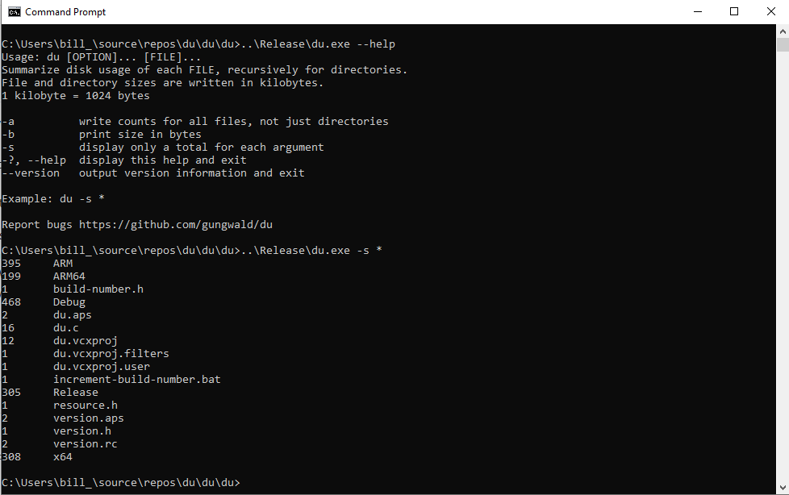

# Disk Usage - du.exe

### Description
This is a Windows version of the UNIX and Linux  command. It has been reimplemented from scratch. The name is shorthand for "disk usage". It is a command line program that displays the disk space used by the files or directories that you specify. For directories, it can display the cumulative size of all files and directories contained in the directory. The other currently available Windows versions of this program are ported from Linux and do not display correct results.

### Efficiency
The code is written to be as fast and efficient as possible. It uses the Win32 API which is the fastest interface for Windows. It is also very small. The x86 version is a total of 18KB.

### Compatibility
The Win32 API also allows it to work on older systems. It should work on systems as old as Windows 95 and possibly Windows 3.1 with Win32s. It should work on Wine and ReactOS also. If it doesn't work for you, create an issue with the above "Issues" menu item.

### No Dependencies
It has no dependencies. For example, it does not require a Visual C++ or Visual Basic runtime library. It does not require Java, Python, .NET Assemblies, node.js, electron or any other silly thing that happens to be trendy right now. So you can drop the du.exe file on any Windows system and it will run. 

### Installation
I suggest putting it in C:\Users\your-user-id\bin and adding that directory to your PATH by searching for "Edit environment variables for your account" in Windows. If you don't understand what I'm talking about, this program might not be for you. I may create an automatic installer but that is a project for another day.

### Build from Source and General Complaining
This builds with Microsoft Visual Studio Community 2019. That is currently the only way to generate executables for Windows ARM. I would like to build it in Fedora Linux with mingw32. But mingw32 will only build the x86 and x64 versions at this time, not the ARM versions. I'm waiting for a solution for building Windows ARM executables on Linux.

### Screenshot of Usage

